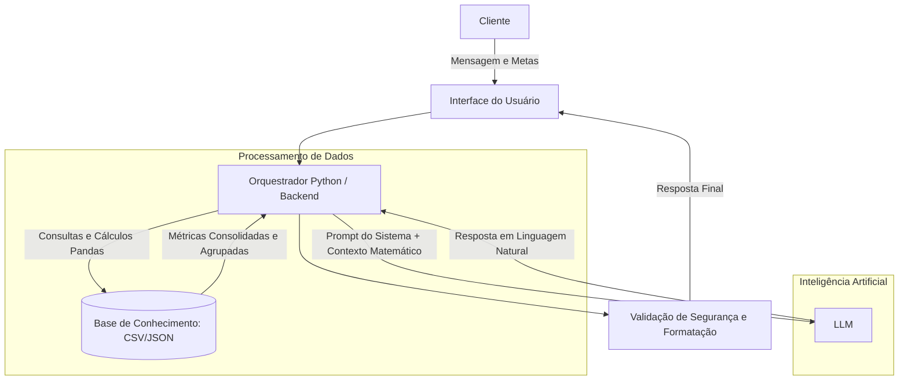

# 🎓 MetaFlow - Seu GPS Financeiro Inteligente

> Agente de IA Generativa focado em planejamento de metas e educação financeira. Ele atua como um verdadeiro "GPS Financeiro", calculando rotas para os seus objetivos e ensinando conceitos de finanças de forma simples e personalizada, extraindo e processando dados reais do seu histórico em banco de dados.

## 💡 O Que é o MetaFlow?

O MetaFlow vai além de um simples chatbot: ele é um agente de análise financeira construído sobre um pipeline robusto de dados. Em vez de apenas responder perguntas genéricas, ele olha para a sua realidade financeira e ajuda a pavimentar o caminho até os seus objetivos.

**O que o MetaFlow faz:**
- 📍 **Traça Rotas para Metas:** Ajuda a planejar objetivos financeiros (ex: reserva de emergência, viagem, aposentadoria) e calcula o esforço necessário com base na sua realidade.
- 🔄 **Recalcula a Rota:** Processa e analisa padrões de gastos consultando diretamente o banco de dados SQL para avisar se você está saindo do caminho do seu planejamento.
- 🚗 **Explica o "Veículo" Certo:** Em vez de recomendar investimentos, ele explica como diferentes produtos financeiros funcionam e como eles se encaixam no horizonte de tempo da sua meta (ex: por que liquidez importa para uma reserva de emergência).
- 🧠 **Garante Contexto Atualizado:** Mantém a IA informada através de pipelines de dados eficientes (ETL com Pandas e SQL).

**O que o MetaFlow NÃO faz:**
- ❌ Não recomenda ativos ou investimentos específicos (foco 100% educativo e de planejamento).
- ❌ Não realiza transações ou movimentações na conta do cliente.
- ❌ Não substitui um consultor financeiro certificado.

## 🏗️ Arquitetura do Sistema



📁 Estrutura do Projeto

```
├── data/                          # Bases estáticas de fallback e dicionários
│   ├── perfil_investidor.json     # Perfil do cliente
│   ├── transacoes.csv             # Histórico financeiro
│   ├── historico_atendimento.csv  # Interações anteriores
│   └── produtos_financeiros.json  # Produtos para ensino
│
├── docs/                          # Documentação completa
│   ├── 01-arquitetura-agente.md   # Desenho da solução (Fluxo MetaFlow)
│   ├── 02-engenharia-dados.md     # Modelagem SQL e fluxos de carga
│   ├── 03-prompts.md              # System prompts e regras anti-alucinação
│   └── 04-metricas.md             # Avaliação de qualidade
│   └── 05-pitch.md                # Apresentação do projeto
│
├── src/
│   ├── app.py                     # Ponto de entrada da aplicação Streamlit
│
└── requirements.txt               # Dependências do projeto
```
