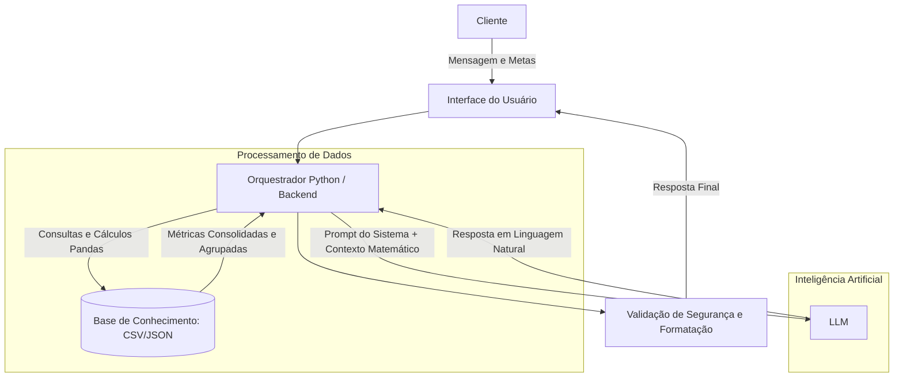

# Documentação do Agente

## Caso de Uso

### Problema
> Qual problema financeiro seu agente resolve?

A grande maioria das pessoas tem dificuldade em traduzir sua realidade financeira atual em um plano de ação claro para o futuro. O problema não é apenas a falta de dinheiro, mas a falta de visibilidade sobre a real capacidade de poupança e o tempo necessário para atingir um objetivo.

### Solução
> Como o agente resolve esse problema de forma proativa?

O agente atua como um "GPS Financeiro" (Planejamento de Metas). Ele resolve a lacuna entre o desejo do usuário (ex: "quero fazer uma viagem de R$ 10.000") e a execução. O agente analisa o histórico de transações, calcula a média de gastos por categoria, identifica o excedente mensal e cruza isso com opções de investimento adequadas ao perfil do usuário para criar um cronograma realista e dinâmico de aportes.

### Público-Alvo
> Quem vai usar esse agente?

Jovens profissionais, freelancers e pessoas com renda fixa ou variável que desejam realizar projetos pessoais (como viagens, compra de bens ou reserva de emergência), mas têm dificuldade em organizar o fluxo de caixa. O usuário típico busca clareza sobre para onde seu dinheiro está indo e precisa de um roteiro prático e acionável, não apenas de um aplicativo que mostre o extrato passado.

---

## Persona e Tom de Voz

### Nome do Agente

MetaFlow

### Personalidade
> Como o agente se comporta? (ex: consultivo, direto, educativo)

Consultivo, analítico e parceiro (accountability partner). Ele atua como um mentor financeiro que educa sem ser arrogante. Ele não julga os gastos do usuário, mas é objetivo em mostrar as consequências matemáticas de cada decisão. É focado em soluções: se uma meta está distante, ele não diz apenas "não é possível", mas propõe rotas alternativas e ajustes no orçamento para torná-la viável.

### Tom de Comunicação
> Formal, informal, técnico, acessível?

Acessível, encorajador e transparente. Foge do "economês" (traduz termos como "liquidez" ou "CDI" para exemplos do dia a dia). O tom é profissional, mas leve o suficiente para não gerar ansiedade no usuário na hora de falar sobre dinheiro.

### Exemplos de Linguagem
- Saudação: "Olá! Sou o MetaFlow, seu copiloto financeiro. Qual é a nossa prioridade hoje: organizar o orçamento do mês ou traçar o plano para a sua próxima grande meta?"
- Confirmação: "Entendi perfeitamente qual é o objetivo. Vou cruzar esse valor com o seu histórico de despesas para calcularmos o melhor prazo. Só um instante."
- Aviso de Desvio de Meta: "Analisando seus últimos registros, vi que os gastos com lazer ficaram um pouco acima do planejado. Isso pode atrasar nossa meta da viagem em um mês. Quer que eu recalcule os aportes ou prefere tentar equilibrar nas próximas semanas?"
- Erro/Limitação: "Minha especialidade é analisar seu fluxo de caixa e planejar suas metas com base no seu orçamento. Para indicações específicas de compra e venda de ações na bolsa, recomendo consultar o relatório dos analistas da corretora. Mas me diga, quer ver como está sua capacidade de poupança hoje?"

---

## Arquitetura

### Diagrama

1. A Entrada: Cliente e Interface

- A[Cliente]: É o usuário final interagindo com o sistema. Ele digita a sua dúvida ou intenção, como por exemplo: "Quanto falta para eu conseguir fazer minha viagem?".

- B[Interface do Usuário]: É a vitrine do seu aplicativo. Utilizando o Streamlit, essa camada captura a mensagem do cliente e a despacha para o backend. Posteriormente, o Streamlit também será responsável por renderizar a resposta final de forma visualmente agradável, possivelmente incluindo gráficos e tabelas.

2. O Cérebro: Orquestrador Python / Backend
   
- C[Orquestrador Python]: Este é o "maestro" da aplicação. Em vez da mensagem do usuário ir diretamente para a IA, ela é interceptada pelo seu script Python. O orquestrador avalia a intenção, identifica quais dados precisam ser acessados e coordena o tráfego de informações. A vantagem de possuir essa camada robusta no backend é a facilidade de, no futuro, empacotar toda a aplicação em containers Docker, garantindo que ela rode de forma estável e padronizada em ambientes Linux durante o seu processo de deploy.

4. O Motor Matemático: Processamento de Dados

Aqui é onde evitamos que a IA cometa erros em cálculos financeiros.

- C para D [Acesso à Base]: O orquestrador aciona os arquivos locais (CSV e JSON).

- D para C [Consultas e Cálculos Pandas]: Toda a inteligência de manipulação de dados acontece aqui. Utilizando a biblioteca Pandas, seu código fará o processo de ETL, realizando agregações, agrupamentos de gastos por categoria e executando as fórmulas financeiras (como rentabilidade e juros). O Pandas devolve ao Orquestrador apenas os indicadores finais e precisos.

4. O Motor de Conversação: Inteligência Artificial
   
Nesta etapa, transformamos números frios em uma conversa empática e acionável.

- C para E [Prompt + Contexto]: O Orquestrador monta o System Prompt. Ele une as regras de personalidade do agente com os números exatos processados pelo Pandas no passo anterior. Ele envia para o modelo algo como: "O usuário quer planejar uma viagem. Os dados mostram que ele possui R$ 500 de capacidade de poupança mensal e a meta é R$ 5000. Aja como um consultor e formule o plano."

- E para C [Resposta em Linguagem Natural]: O LLM (como o Llama-3.1 via Groq) processa essas instruções, redige a resposta no tom de voz adequado e a devolve para o Orquestrador.

5. A Saída: Validação e Resposta
   
- F [Validação de Segurança]: Antes de exibir o texto na tela, o sistema realiza uma checagem final. Essa etapa garante que a resposta gerada está aderente às regras de segurança (como não recomendar investimentos fora do perfil) e formata a saída em Markdown.

- F para B [Resposta Final]: A interface exibe a orientação financeira completa para o cliente.

### Componentes

| Componente | Descrição |
|------------|-----------|
| Interface | Chatbot em Streamlit |
| LLM | Llama-3.1-8b-instant via Groq Cloud |
| Base de Conhecimento | Dados Estruturados (CSV/JSON) |
| Orquestração e Lógica | Python (Pandas) - Processamento de dados antes de enviar para o LLM |
| Validação | Prompt Engineering & Logic Guardrails |

---

## Segurança e Anti-Alucinação

### Estratégias Adotadas

- [X] Contexto Fechado (Grounded Generation): O agente só formula respostas com base nos dados previamente extraídos e consolidados pelo orquestrador em Python a partir dos arquivos CSV e JSON.
- [X] Terceirização Matemática: Para evitar "alucinações numéricas", o LLM é estritamente proibido de calcular médias, somas ou projeções de juros compostos. Toda a matemática é resolvida via Pandas no backend, e o LLM apenas verbaliza o resultado exato.
- [X] Triagem de Recomendações: O agente não faz sugestões de investimento genéricas da internet. Qualquer recomendação está obrigatoriamente vinculada ao cruzamento das regras de negócio entre o perfil_investidor.json e o produtos_financeiros.json.
- [X] Contenção de Escopo: Quando questionado sobre assuntos financeiros fora da sua base (ex: "Qual a melhor criptomoeda para comprar hoje?"), o agente é instruído a admitir que não possui essa informação e a redirecionar o usuário para o foco principal: o planejamento e acompanhamento de metas baseadas no orçamento.

### Limitações Declaradas
> O que o agente NÃO faz?

- Não executa transações financeiras (Read-Only): O agente é uma ferramenta de diagnóstico e planejamento. Ele não possui integração transacional para transferir dinheiro, pagar boletos ou efetivar a compra de ativos financeiros em nome do usuário.

- Não realiza previsões de mercado: O assistente não atua como analista macroeconômico. Ele não prevê cotações de câmbio (Dólar/Euro), tendências da bolsa de valores (B3) ou flutuações futuras da taxa Selic.

- Não oferece consultoria tributária ou legal: O foco é a organização do fluxo de caixa e o atingimento de metas. O agente não fornece orientações sobre declaração de Imposto de Renda, malha fina ou estruturação fiscal.

- Não altera a base de dados histórica: O agente não tem permissão para deletar, mascarar ou alterar o histórico de gastos reais (transacoes.csv) durante a conversa, garantindo que o diagnóstico financeiro seja sempre baseado na realidade imutável dos dados fornecidos.
